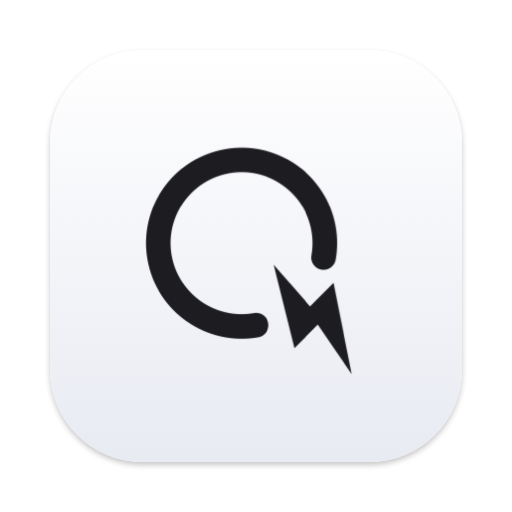
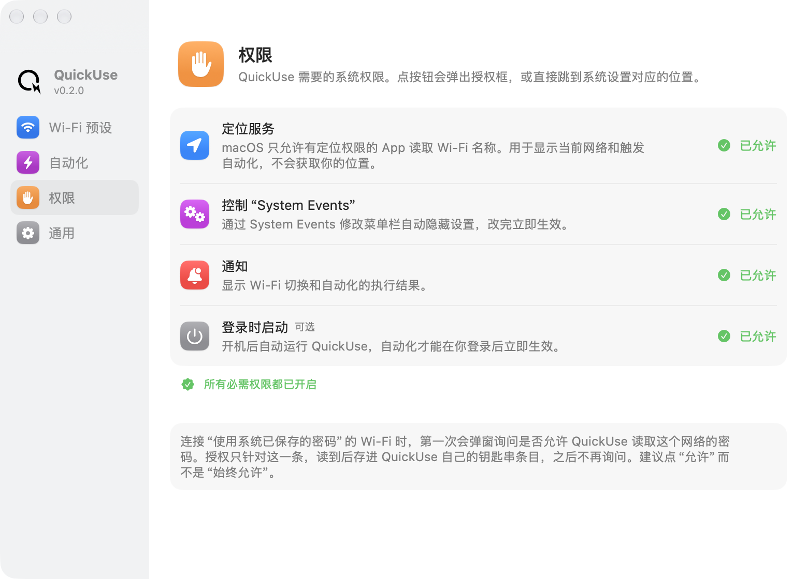

<div align="center">



# QuickUse

**一个模块化的 macOS 菜单栏小工具：一键切换 Wi‑Fi 预设、切换菜单栏自动隐藏，并按网络自动执行动作。**


[](LICENSE)

</div>

<p align="center">
  
</p>

## 功能

- **Wi‑Fi 预设**：按“家”“学校”等分组，在菜单里点一下即可切换
  - 从这台 Mac 连过的网络中搜索选择，沿用系统已保存的密码
  - 支持 WPA2 企业网络（如 eduroam）和隐藏网络
  - 先按名称定向扫描，附近没有这个网络时直接提示，不会盲连
- **菜单栏自动隐藏**：在“始终 / 永不”之间切换，和 系统设置 → 控制中心 是同一个设置，双向同步
- **自动化**：条件满足时依次执行动作，例如
  > 连上 `eduroam` → 菜单栏设为始终隐藏 → 打开 Zotero → 打开 Notion
- **通知**：Wi‑Fi 切换与自动化结果通知，自带防抖合并，快速连续操作也不会刷屏
- **原生界面**：SwiftUI 设置窗口，采用 macOS 26 的新外观

## 安装

需要 macOS 26 及以上、Xcode 26 及以上（命令行工具即可编译，但需要完整 SDK）。

```sh
git clone https://github.com/Chestnutye/quickuse.git
cd quickuse
scripts/build.sh --install   # 编译并安装到 /Applications，设为登录时启动
```

只想编译不安装：`scripts/build.sh`，产物在 `build/QuickUse.app`。

### 首次运行需要的权限

| 权限 | 用途 |
| --- | --- |
| 定位服务 | macOS 只允许有定位权限的 App 读取 Wi‑Fi 名称。QuickUse 不获取位置，也不在后台轮询，只在网络变化和打开菜单时读取一次 |
| 通知 | 显示 Wi‑Fi 切换和自动化结果 |
| 自动化 → System Events | 修改菜单栏自动隐藏设置 |
| 登录时启动（可选） | 开机后自动运行 |

缺少必需权限时，App 启动后会自动打开 **设置 → 权限** 页：没询问过的权限点一下弹出系统授权框，被拒绝的直接跳到系统设置对应位置，切回来状态自动刷新。

### Wi‑Fi 密码

macOS 不会把系统保存的 Wi‑Fi 密码自动交给第三方 App，所以：

- **个人网络**（WPA2/WPA3 个人）：添加预设时弹出一次系统授权，读取这一个网络的密码。由 QuickUse 进程自己读取，即使选了“始终允许”也只对 QuickUse 放行。
- **企业网络**（eduroam 等）：不读取系统密码，只自动填入账号名，密码由你填写一次。
- 密码只保存在本机钥匙串中 QuickUse 自己的条目里，名称以 `QuickUse` 开头。

> [!NOTE]
> 系统的权限和钥匙串授权都绑定在 App 的签名上。`build.sh` 会自动使用本机的 Apple Development 证书签名（也可用环境变量 `QUICKUSE_SIGN_IDENTITY` 指定），这样重新编译后授权依然有效；没有证书时退回临时签名（ad-hoc），每次重新编译后系统会再次询问。

## 防抖设计

网络抖动、快速重复操作都不会导致重复执行或通知刷屏：

| 层级 | 规则 | 位置 |
| --- | --- | --- |
| 网络稳定 | SSID 稳定 N 秒（默认 8 秒，可调）才算连上；断开后又连回同一网络不算新连接 | `WiFiModule.settle()` |
| 规则冷却 | 规则执行后在冷却时间内（每条规则单独设置，默认 30 分钟）不再执行；执行中再次命中也会忽略 | `AutomationModule.handle()` |
| 动作幂等 | App 已在运行就跳过；菜单栏已是目标状态就跳过 | 各动作的 `run` |
| 动作间隔 | 同一规则里连续打开多个 App，每个之间间隔 2000 ms | `ActionDefinition.spacing` |
| 通知 | 同类通知防抖 2 秒、最长等待 6 秒，合并成一条并覆盖通知中心里的旧通知 | `Notifier` |

## 项目结构

```
Sources/QuickUse/
├── Core/                  框架层
│   ├── Automation/        自动化引擎、规则编辑器
│   ├── Permissions/       权限检查页
│   ├── Settings/          设置窗口、通用设置
│   ├── AppDelegate.swift  菜单栏图标与菜单组装
│   ├── Module.swift       模块协议
│   ├── ModuleRegistry.swift
│   ├── Notifier.swift     带防抖的通知
│   └── Keychain.swift / ModuleStorage.swift / Shell.swift
└── Modules/               功能模块
    ├── WiFi/
    ├── MenuBar/
    └── AppLauncher/
Resources/                 Info.plist、StatusIcon.svg、AppIcon.icns
scripts/
├── build.sh               编译打包
└── make-icon.swift        由 StatusIcon.svg 生成 AppIcon.icns
```

## 扩展：添加一个新功能

每个功能都是一个实现了 `Module` 协议的类。协议里的方法都有默认实现，只写需要的部分：

```swift
@MainActor
final class CaffeineModule: Module {
    let id = "caffeine"   // 同时是数据目录名，确定后不要改

    func start(context: ModuleContext) { … }

    // 菜单项：每次打开菜单时重新生成
    func menuItems() -> [NSMenuItem] {
        [ActionMenuItem("保持唤醒", image: "cup.and.saucer") { … }]
    }

    // 设置窗口里的一页
    func settingsPanes() -> [SettingsPane] { … }

    // 提供给自动化的触发条件和动作，规则编辑器会自动出现对应选项
    func automationTriggers() -> [TriggerDefinition] { … }
    func automationActions() -> [ActionDefinition] { … }

    // 需要的系统权限，会出现在 设置 → 权限 页；必需权限缺失时启动后自动打开该页
    func permissions() -> [PermissionItem] { … }
}
```

然后在 `Core/ModuleRegistry.swift` 中注册，数组顺序就是菜单中的顺序。

模块可以使用的基础能力：

| 能力 | 说明 |
| --- | --- |
| `context.storage` | 模块独立的 JSON 存储，位于 `~/Library/Application Support/QuickUse/<id>/` |
| `Keychain` | 保存密码等敏感信息 |
| `context.events.post(_:)` | 发出事件，自动化规则据此触发 |
| `Notifier.post(_:title:body:)` | 发送通知（新的类别加在 `Notifier.Category`） |
| `Shell.run` / `Shell.appleScript` | 调用命令行或 AppleScript |
| `ParamSpec` | 描述动作和触发条件的参数，规则编辑器据此生成输入控件 |
| `Permissions.*Item` | 现成的权限声明：定位、通知、控制某个 App（Apple 事件）、登录项；也可以自定义 `PermissionItem` |

## 图标

菜单栏图标与程序坞图标都来自 [`Resources/StatusIcon.svg`](Resources/StatusIcon.svg)：字母 Q 的尾巴是一道闪电。修改 SVG 后运行：

```sh
swift scripts/make-icon.swift
```

## 许可证

[MIT](LICENSE) © 2026 Chestnutye
